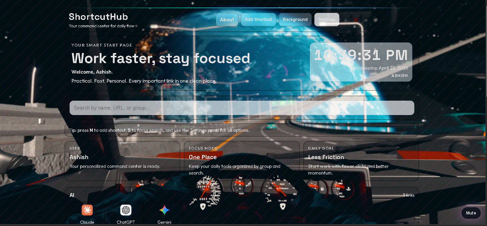

# ShortcutHub

Your launchpad, your vibe, your flow. 🚀

ShortcutHub is a personal start page designed for fast daily execution, visual clarity, and smooth motion. It keeps your links organized in groups and lets your background media stay the hero.

## Live Demo

Live demo: add your link here later.

Example placeholder:

- [https://your-live-demo-link-here](https://short-cut-hub.vercel.app/)

## The Story Behind It

### The idea 💡

Every day starts with the same routine: open a browser, open the same tools, search the same tabs, repeat.

I wanted one beautiful, practical command center where everything important is one click away.

### The problem 😵

- Default bookmark bars get crowded quickly.
- Important links get buried.
- Context switching kills focus.
- Most start pages either look plain or feel too heavy.

### Thought process 🧠

I asked a simple question:

How can I keep it fast like bookmarks, but make it feel premium and alive?

The approach:

- Keep the stack lightweight (plain HTML, CSS, JS).
- Store everything in browser local storage.
- Use grouped cards for quick scanning.
- Add motion and depth without adding build complexity.

### Solution ✅

ShortcutHub combines:

- grouped shortcuts (AI, Daily, Career, Social, and more)
- fast search
- quick add/edit/delete
- drag and drop reorder
- default animated wallpaper background
- focused settings and onboarding flow

## 3D Feel and Motion ✨

Even with a lightweight stack, the interface is designed to feel dimensional and alive.

- subtle 3D-like hover lift on cards and panels
- motion transitions for interactions
- smooth reveal and entry animations
- glow-based hover states for depth cues
- responsive behavior tuned for desktop and mobile

## Current Defaults (What New Users See)

When someone downloads this project and opens it fresh, the default setup is:

- light-first visual mode
- default accent: #3de0d0
- default background fallback: space-drive.webm
- first-run onboarding with name capture
- local persistence key: shortcuthub_data_v6

So yes, new users get the same baseline experience out of the box. 🎯

## Features

- editable shortcut cards
- group-based organization
- drag-and-drop ordering
- keyboard shortcuts for speed
- smart background dialog (image/video URL or upload)
- real-time clock with seconds
- settings tabs for appearance/behavior/background/profile
- per-user persistence in local storage

## Tech Stack

- HTML
- CSS
- JavaScript (vanilla)

No framework. No build step. Open and run.

## Project Structure

- index.html
- styles.css
- app.js
- about.html
- space-drive.webm
- SSS.png

## Run Locally

1. Download or clone this repository.
2. Open the project folder.
3. Open index.html in your browser.

Optional: use a local server extension for smoother development workflow.

## Why This Style Works

- wallpaper stays visually dominant
- card boundaries stay clear with crisp outlines
- interaction states are obvious and smooth
- fast load, low complexity, easy to maintain

## Ideas for Future Upgrades

- widget cards (weather, notes, tasks)
- per-group custom colors
- multi-layout presets
- installable PWA version
- cloud sync for settings and links

## License

This project is licensed under the MIT License.
See the LICENSE file for full text.
